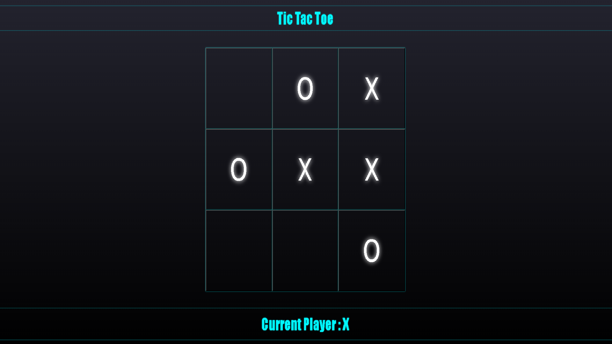
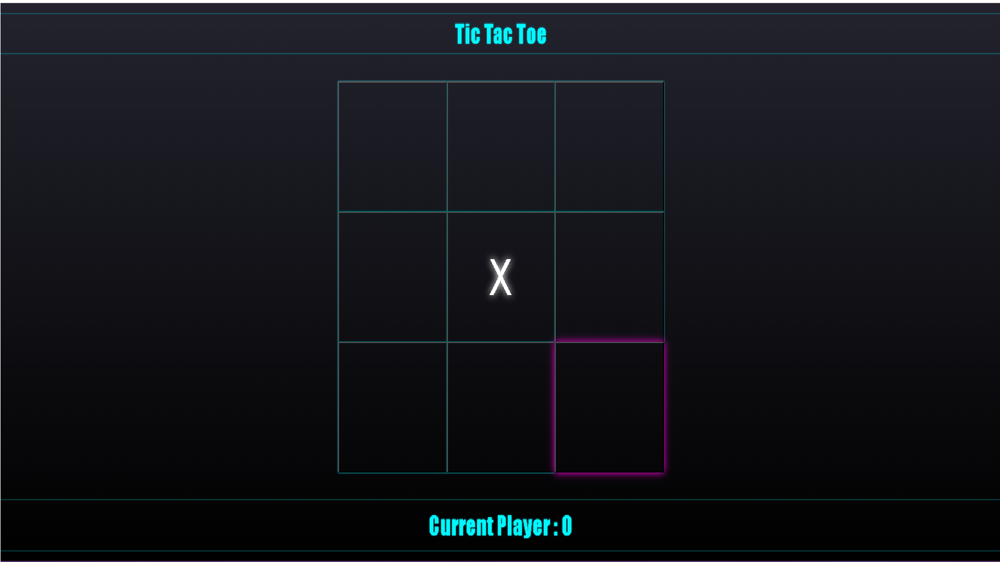

# Tic Tac Toe- By Parth

---

##### This is a simple tic tac toe game built using HTML, CSS, and JavaScript.

### How to Play
---

##### To play the game, simply open index.html file in your web browser. Click on any cell of the 3x3 grid to place your mark (X or O). The game will automatically switch turns between players until the game is won, tied or reset.

## How to Run
---
##### To run the game, simply download or clone the repository and open the index.html file in your web browser.

##### Copy code
---
##### git clone https://github.com/your-username/tic-tac-toe.git
##### Alternatively, you can play the game on this GitHub Page```

## Features
---

* Simple and easy-to-understand UI
* Auto switching turns between players
* Display winner or draw message
* Reset the game


## SCREENSHOTS
---






## License
---
##### This game is licensed under the MIT License.

